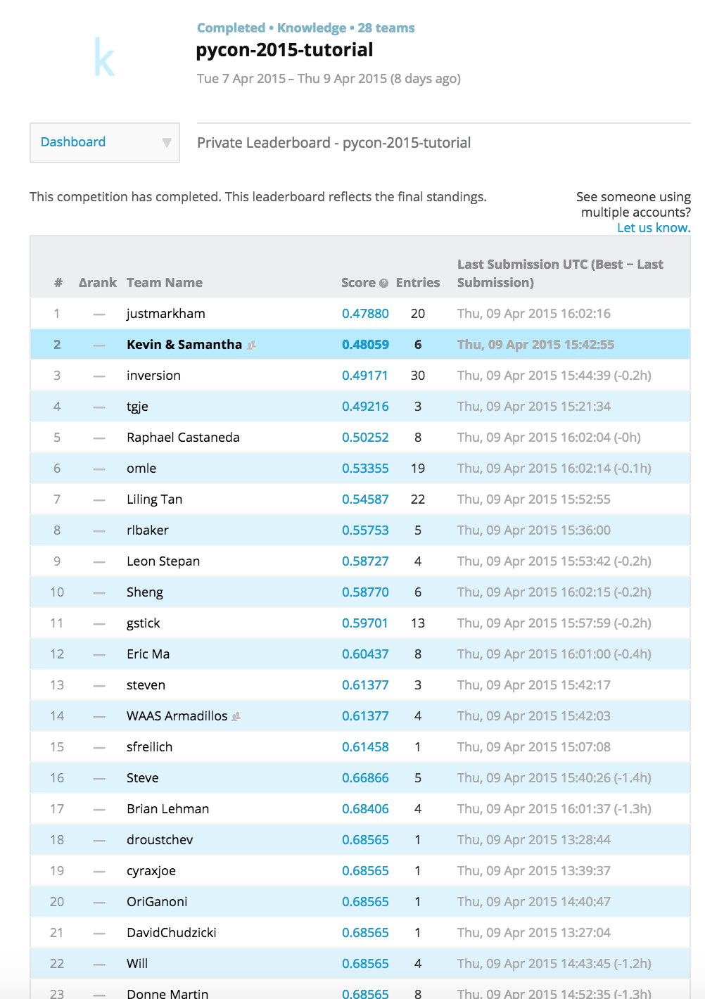

# pycon-kaggle-tutorial-2015

Kaggle hosted a competition during the tutorial [Winning Machine Learning Competitions with scikit-learn](https://us.pycon.org/2015/schedule/presentation/321/) at [PyCon 2015](https://us.pycon.org/2015/), on April 9 in Montreal.

The [Kaggle competition](https://inclass.kaggle.com/c/pycon-2015-tutorial) was to correctly predict the open or closed status of Stack Overflow questions given information about their content and metadata.

I worked with Kevin Goetsch and we received 2nd place out of 28 teams.  The first place winner was Kevin Markham, whose solutions have also been [posted](https://github.com/justmarkham/kaggle-pycon-2015).

Our code is [here](kaggle_stack_overflow.py), the tutorial repo is [here](https://github.com/dchudz/pycon2015-kaggle-tutorial), and the data files are [here](https://inclass.kaggle.com/c/pycon-2015-tutorial/data).

Please [contact me](http://twitter.com/sjwhitmore) with any further questions!

-----

